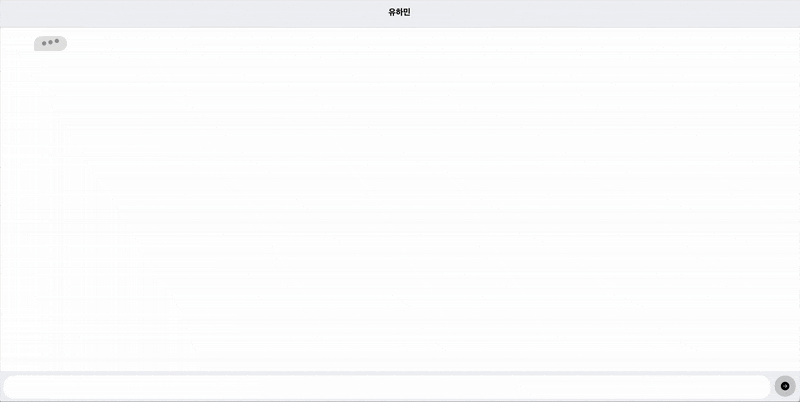

# Interactive Chat RSVP Invitation

A unique, interactive RSVP web app that simulates a real-time chat conversation on a mobile device. This project was designed in Figma and developed as a self-contained HTML file for a birthday cafe event.

[**Live Demo on Netlify**](haminnie-bday.netlify.app)

### Motivation

This project was created to provide a more engaging and personal experience for event guests, moving beyond traditional invitation formats by simulating a real-time, interactive chat.

### Features

* **Realistic UI:** Mimics a smartphone lock screen and messaging application.

* **Dynamic Lock Screen:** Displays the user's current local time and date.

* **Animated Notifications:** A notification banner slides down to begin the experience.

* **Simulated Chat Flow:** An automated, timed message sequence creates a realistic conversation.

* **Interactive Replies:** The user's message box is pre-filled and animates with a typing effect before sending.

* **Self-Contained:** The entire application runs in a single HTML file, requiring no complex setup.

### Language

This project was originally developed with Korean text for the chat messages.

* The Figma prototype reflects this and contains the original Korean chat.

* The main `index.html` file in the repository contains the English version.

* A separate folder titled `HM_BD` is included, which contains the Korean version.

### Tech Stack & Tools

* **Frontend:** HTML5, CSS3, JavaScript

* **Styling:** Tailwind CSS

* **Design & Prototyping:** Figma

* **Deployment:** Netlify & GitHub

### Design & Development Process

This project began as a high-fidelity prototype in Figma, focusing on user flow and animation timing. The design was then translated into a functional, single-file web application for maximum portability and ease of sharing.

[**View the Figma Prototype**](https://www.figma.com/design/FBuk89DXDLw0LI1wvd18tL/Birthday-RSVP?node-id=0-1&t=scNbIJQKgNjJwdq2-1) 
